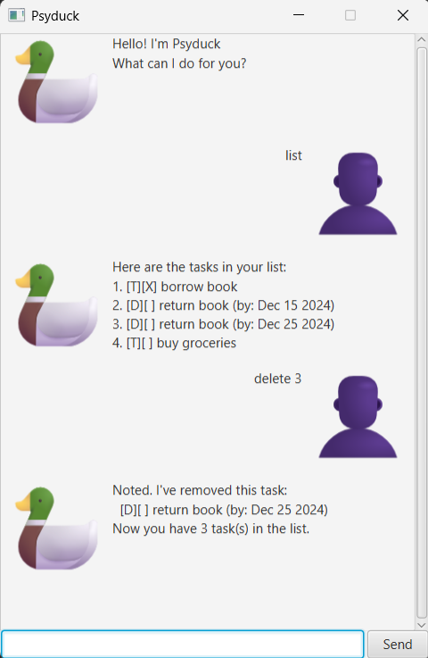

# Psyduck User Guide 🦆

Psyduck is a **personal task manager** that helps you organize your tasks efficiently through a simple command-line interface with a beautiful GUI.

---

## Quick Start

1. Ensure you have Java 17 or above installed
2. Download the latest `Psyduck.jar` from the [releases page](https://github.com/fjxfong/ip/releases)
3. Double-click the JAR file to launch, or run: `java -jar Psyduck.jar`
4. Type commands in the input box and press Enter or click Send
5. Type `help` to see all available commands

---

## Features

### Adding Tasks

#### Add a ToDo task
Format: `todo DESCRIPTION`

Example: `todo Read book`

#### Add a Deadline
Format: `deadline DESCRIPTION /by DATE`

Example: `deadline Submit report /by 2024-12-25`

Date formats supported:
- `yyyy-MM-dd` (e.g., 2024-12-25)
- `dd/MM/yyyy` (e.g., 25/12/2024)
- `MM/dd/yyyy` (e.g., 12/25/2024)
- `MMM dd yyyy` (e.g., Dec 25 2024)

#### Add an Event
Format: `event DESCRIPTION /from START_DATE /to END_DATE`

Example: `event Team meeting /from 2024-12-20 /to 2024-12-21`

---

### Managing Tasks

#### List all tasks
Format: `list`

Shows all your tasks with their numbers, types, completion status, and tags.

#### Mark task as done
Format: `mark TASK_NUMBER`

Example: `mark 2`

#### Mark task as not done
Format: `unmark TASK_NUMBER`

Example: `unmark 2`

#### Delete a task
Format: `delete TASK_NUMBER`

Example: `delete 3`

---

### Tagging Tasks

#### Add a tag
Format: `tag TASK_NUMBER #TAG`

Example: `tag 1 #work`

You can add multiple tags to a task by repeating the command.

#### Remove a tag
Format: `untag TASK_NUMBER #TAG`

Example: `untag 1 #work`

#### Find tasks by tag
Format: `findtag #TAG`

Example: `findtag #urgent`

---

### Searching Tasks

#### Search by keyword
Format: `find KEYWORD`

Example: `find book`

Finds all tasks containing the keyword in their description.

#### Search by date
Format: `finddate DATE`

Example: `finddate 2024-12-25`

Finds all deadlines on that date and events that span that date.

---

### Other Commands

#### Exit the application
Format: `bye`

Closes the application after a short delay.

---

## Command Summary

| Command | Format | Example |
|---------|--------|---------|
| Add ToDo | `todo DESCRIPTION` | `todo Buy milk` |
| Add Deadline | `deadline DESCRIPTION /by DATE` | `deadline Submit homework /by 2024-12-31` |
| Add Event | `event DESCRIPTION /from DATE /to DATE` | `event Conference /from 2024-12-20 /to 2024-12-21` |
| List tasks | `list` | `list` |
| Mark task | `mark NUMBER` | `mark 2` |
| Unmark task | `unmark NUMBER` | `unmark 2` |
| Delete task | `delete NUMBER` | `delete 3` |
| Add tag | `tag NUMBER #TAG` | `tag 1 #work` |
| Remove tag | `untag NUMBER #TAG` | `untag 1 #work` |
| Find by tag | `findtag #TAG` | `findtag #urgent` |
| Search keyword | `find KEYWORD` | `find meeting` |
| Search date | `finddate DATE` | `finddate 2024-12-25` |
| Help | `help` | `help` |
| Exit | `bye` | `bye` |

---

## Data Storage

Your tasks are automatically saved to `./data/psyduck.txt` after every change. The file is created automatically if it doesn't exist.

To use a different data file location, you can modify the file path in the source code.

---

## Acknowledgements

- JavaFX for the GUI framework
- JUnit for testing framework
- CS2103T teaching team for project guidance

---

**Enjoy using Psyduck! 🦆**